# Text Analyzer for Serbian Language

A web application built as a Master's thesis at the University of Vienna. It applies a full suite of NLP techniques to Serbian-language text and presents the results progressively in the browser as each analysis step completes. The same pipeline is also exposed as a documented REST API.

<p align="center">
  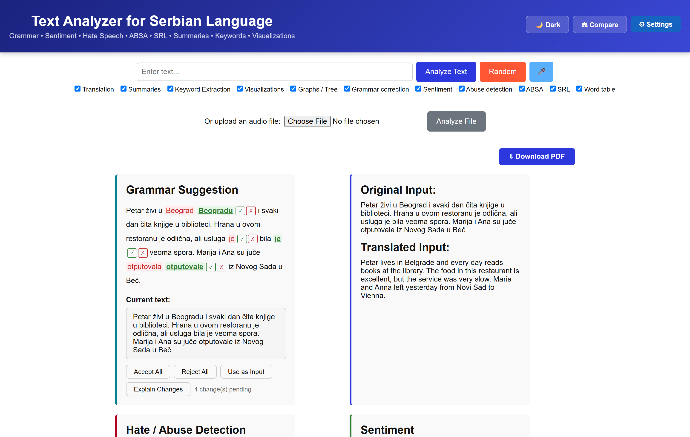
</p>

---

## Features

| Feature | Description |
|---|---|
| **Grammar Correction** | Suggests a corrected version of the input using an LLM, with an interactive word-level diff (accept / reject each change individually) |
| **Translation** | Translates the Serbian input to English |
| **Sentiment Analysis** | Overall and per-sentence sentiment (negative / neutral / positive) with confidence scores |
| **Hate / Abuse Detection** | Overall and per-sentence hate-speech classification |
| **Aspect-Based Sentiment Analysis (ABSA)** | Identifies aspects in each sentence and classifies their sentiment |
| **Extractive Summary** | Key sentences selected from the text using TF-IDF + TextRank |
| **Abstractive Summary** | Free-form summary generated by an LLM, with English translation |
| **Keyword Extraction** | Top terms per topic via Latent Dirichlet Allocation (LDA) |
| **Semantic Role Labeling (SRL)** | Predicate–argument structure for each sentence |
| **Word Table** | Per-word breakdown: translation, lemma, local & online definition, POS, number, person, case, gender, dependency head & relation, NER tag |
| **Dependency Tree** | Interactive graph of the syntactic dependency tree (pyvis) |
| **Word Cloud** | Frequency-weighted cloud of lemmas |
| **NER Heatmap** | Heatmap of named-entity labels across the text |
| **POS Sunburst Chart** | Distribution of part-of-speech tags |
| **Model Comparison** | Run the same text through two different LLM backends and compare their outputs side by side (`/compare`) |
| **Voice Input** | Record speech directly in the browser; transcribed with Whisper |
| **Random Sentence** | Load a random sentence from a Serbian fairy-tale corpus |
| **PDF Export** | Print the full analysis output as a PDF via the browser |
| **Dark / Light Theme** | Toggle between themes; preference is saved in `localStorage` |
| **REST API** | Full pipeline and per-module endpoints with Swagger UI at `/docs` |

Results load progressively — each section appears as soon as its analysis finishes, without waiting for the full pipeline.

---

## Screenshots

### Grammar correction with interactive diff

Every suggested change can be accepted ✓ or rejected ✗ individually; **Explain Changes** asks the LLM to justify each edit, and **Use as Input** feeds the corrected text back into the analyzer.

<p align="center">
  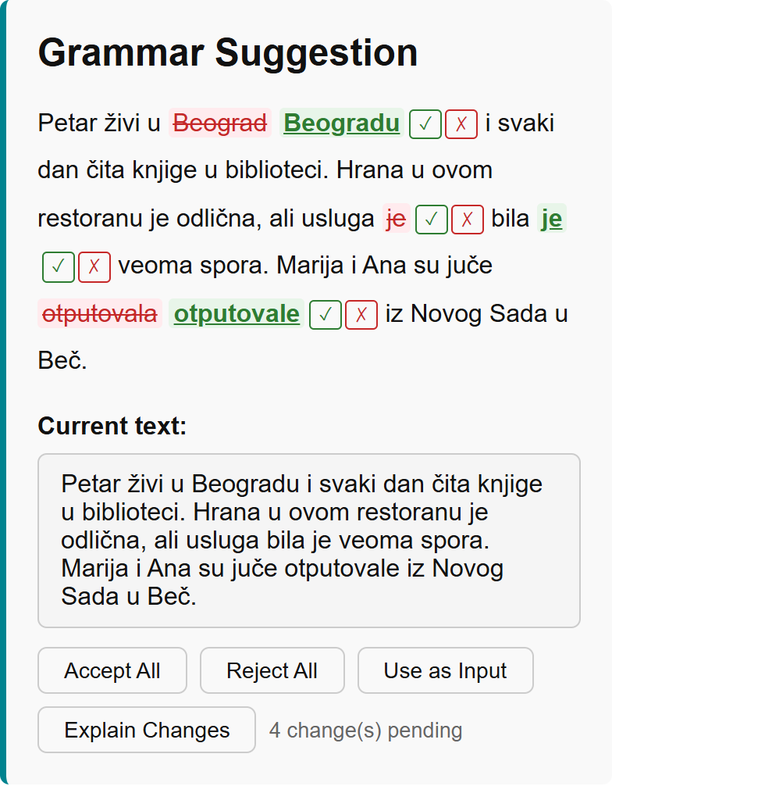
</p>

### Sentiment analysis & hate-speech detection

Overall classification plus a per-sentence breakdown with confidence scores.

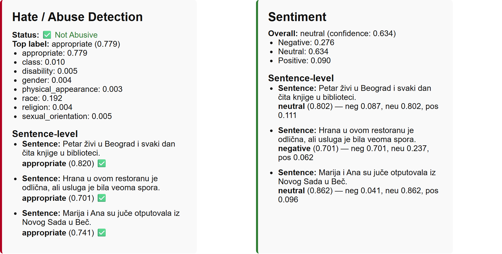

### Aspect-based sentiment analysis

Aspects identified per sentence, each with sentiment, confidence, and the evidence span (with English glosses).

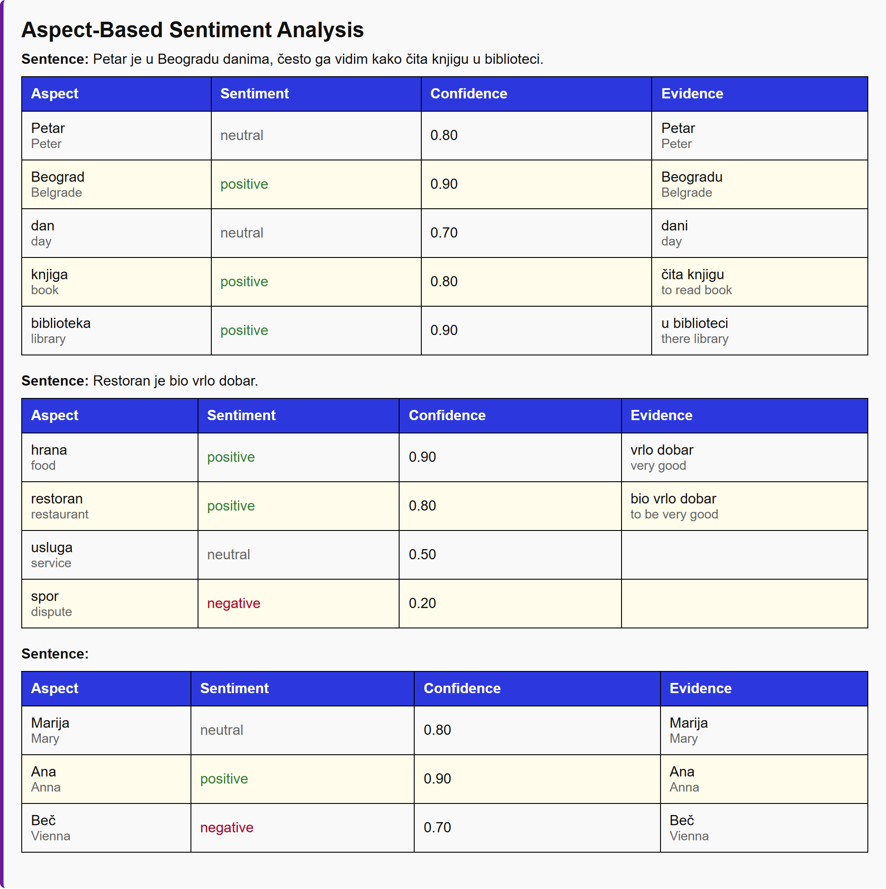

### Summaries & keyword extraction

<p>
  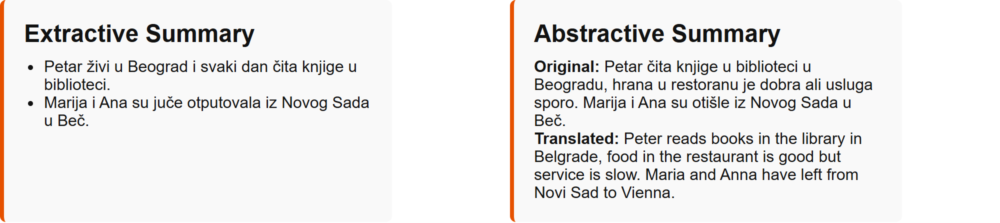
  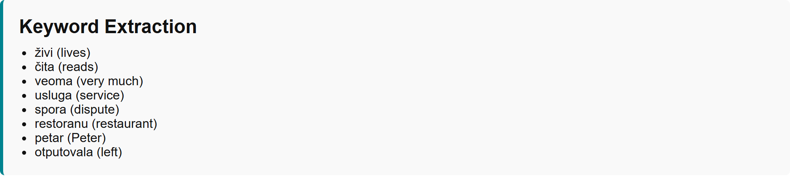
</p>

### Semantic role labeling & dependency tree

<p>
  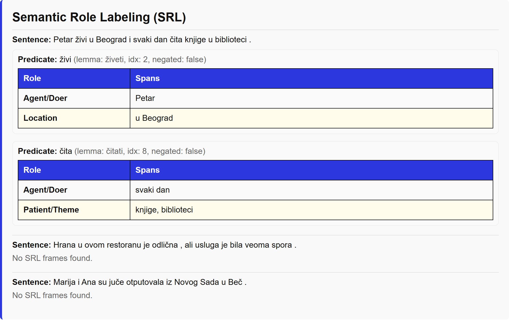
  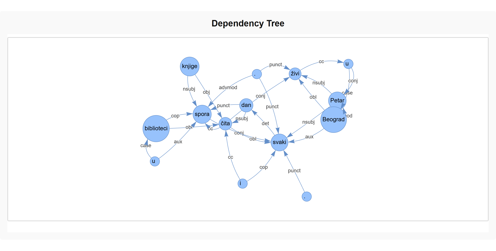
</p>

### Word-level analysis

Per-word translation, lemma, definitions, morphological features, dependency relation, and NER tag.

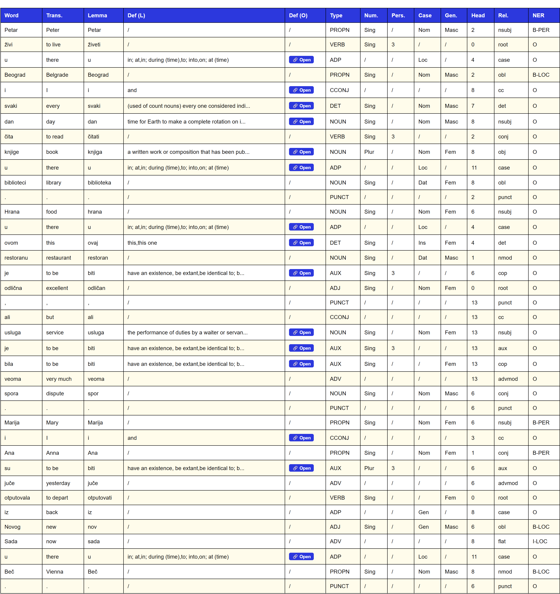

### Visualizations

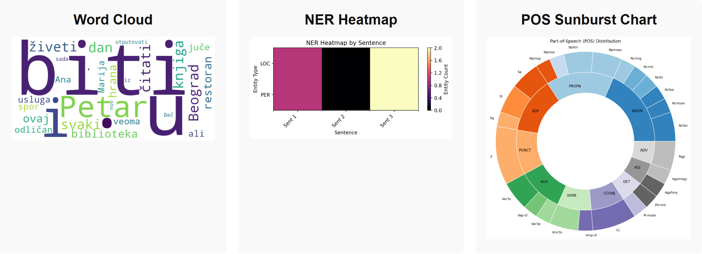

### Dark theme

<p align="center">
  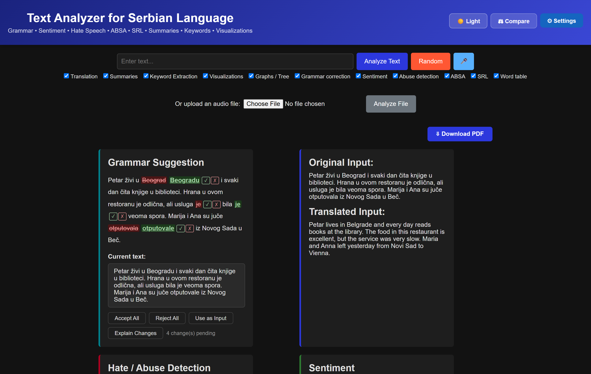
</p>

---

## Models

### Via Ollama (local) or OpenAI-compatible endpoint (remote)
| Task | Default model |
|---|---|
| Grammar correction | `llama3.1:8b` |
| SR → EN translation | `llama3.1:8b` |
| ABSA | `llama3.1:8b` |
| Abstractive summarization | `llama3.1:8b` |
| Semantic role labeling | `llama3.1:8b` |

The active model and backend (local Ollama vs. remote vLLM) can be changed at runtime via the **Settings** modal — no restart needed.

### Via Hugging Face Transformers
| Task | Model |
|---|---|
| Sentiment analysis | `cardiffnlp/twitter-xlm-roberta-base-sentiment` |
| Hate speech detection | `sadjava/multilingual-hate-speech-xlm-roberta` |

> **Sentiment engine** defaults to the cardiffnlp classifier above, but can be switched to the selected LLM backend (local Ollama or remote) in the **Settings** modal.

### Other
| Task | Model |
|---|---|
| Tokenization, lemmatization, POS, NER, dependency parsing | Classla Serbian pipeline (`sr`) |
| Speech-to-text | OpenAI Whisper (configurable: tiny / base / small / medium / large) |

All models automatically use a CUDA GPU when one is available and fall back to CPU otherwise.

---

## Requirements

- Python **3.11.9**
- [Ollama](https://ollama.com) installed and running (for local LLM mode)
- `llama3.1:8b` pulled in Ollama
- A CUDA-capable GPU is recommended but not required

---

## Setup

**1. Install Python dependencies**
```bash
pip install -r requirements.txt
```

**2. Download the Classla Serbian language model**
```bash
python -c "import classla; classla.download('sr')"
```

**3. Install Ollama and pull the LLM**

Download Ollama from https://ollama.com, then:
```bash
ollama pull llama3.1:8b
```

**4. Configure the backend (optional)**

Copy the example config and edit as needed:
```bash
cp config.example.json config.json
```

`config.json` is ignored by git. If it is absent, the app uses sensible defaults (local Ollama, `llama3.1:8b`, Whisper `medium`). Settings can also be changed at runtime via the **Settings** modal in the UI.

**5. Run the app**
```bash
python app.py
```

Open http://127.0.0.1:5000 in any browser.  
Swagger UI is available at http://127.0.0.1:5000/docs.

---

## Configuration

`config.json` (not committed — create from `config.example.json`):

```json
{
  "mode": "local",
  "whisper_model": "medium",
  "local": {
    "model": "llama3.1:8b"
  },
  "remote": {
    "base_url": "http://your-gpu-server:8001/v1",
    "model": "your-fine-tuned-model",
    "api_key": "not-needed"
  }
}
```

| Field | Description |
|---|---|
| `mode` | `"local"` (Ollama) or `"remote"` (OpenAI-compatible vLLM endpoint) |
| `whisper_model` | Whisper model size: `tiny`, `base`, `small`, `medium`, `large` |
| `local.model` | Ollama model name |
| `remote.base_url` | Base URL of the remote OpenAI-compatible API |
| `remote.model` | Model name on the remote server |
| `remote.api_key` | API key (use `"not-needed"` if the server requires none) |

All of this can also be changed at runtime from the **Settings** modal — the backend, the Ollama model (auto-detected from the local Ollama installation), and the Whisper model size:

<p align="center">
  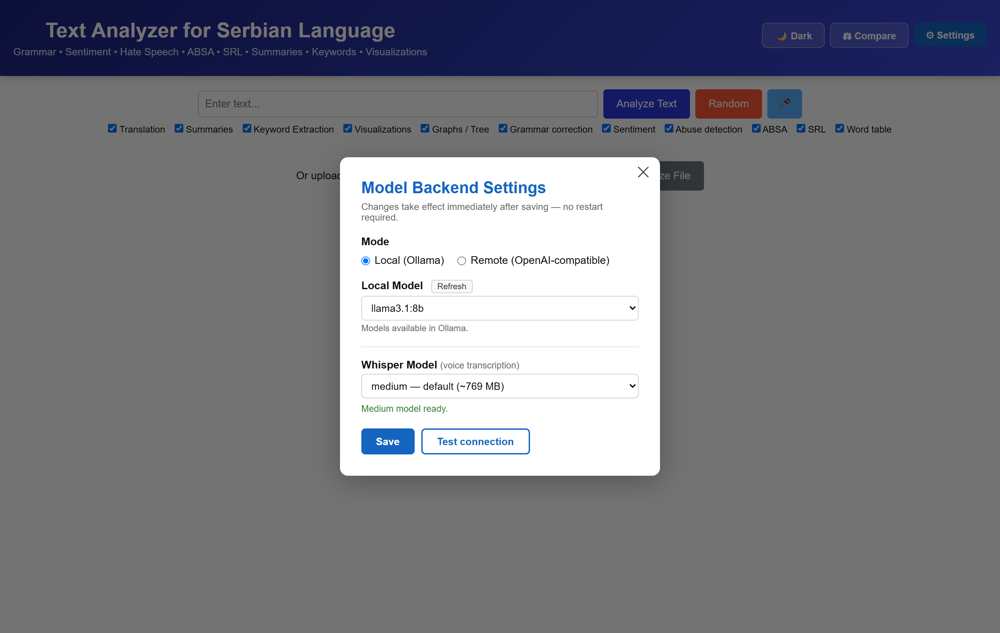
</p>

---

## Model Comparison

The `/compare` page runs the same text through **two different LLM backends** (e.g., local `llama3.1:8b` vs. a remote fine-tuned model on vLLM) and shows the outputs side by side — useful for evaluating a fine-tuned model against its base model.

<p align="center">
  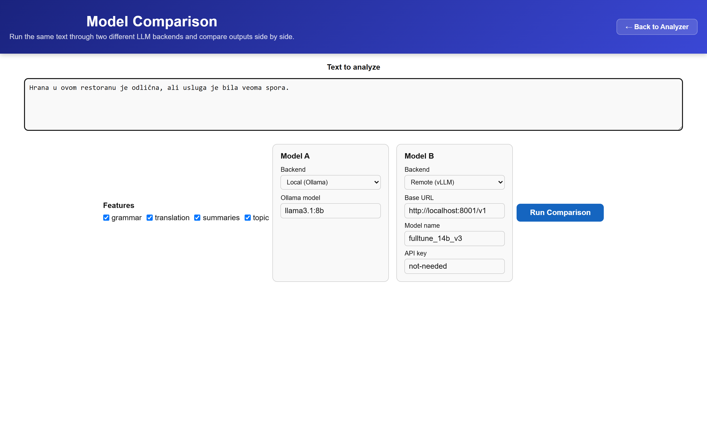
</p>

---

## REST API

The full pipeline and individual modules are available as a JSON API. Swagger UI with interactive documentation is at `/docs`.

| Endpoint | Method | Description |
|---|---|---|
| `/api/v1/analyze` | POST | Submit text for full async analysis; returns `job_id` |
| `/api/v1/jobs/<job_id>` | GET | Poll job status and retrieve results when finished |
| `/api/v1/sentiment` | POST | Sentiment analysis only |
| `/api/v1/grammar` | POST | Grammar correction only |
| `/api/v1/grammar/explain` | POST | Explain each grammar change (LLM call) |
| `/api/v1/translate` | POST | SR → EN translation only |
| `/api/v1/hate-speech` | POST | Hate speech detection only |
| `/api/v1/srl` | POST | Semantic role labeling only |
| `/api/v1/absa` | POST | Aspect-based sentiment only |
| `/api/v1/ner` | POST | Named entity recognition only |
| `/api/v1/summarize` | POST | Extractive + abstractive summarization |
| `/api/v1/summarize/extractive` | POST | Extractive summary only |
| `/api/v1/summarize/abstractive` | POST | Abstractive summary only (LLM call) |
| `/api/v1/topics` | POST | Keyword extraction (LDA topics) only |
| `/api/v1/transcribe` | POST | Transcribe an audio file (multipart); add `?analyze=true` to also run analysis |

**Quick example:**
```python
import requests, time

r = requests.post("http://localhost:5000/api/v1/sentiment",
                  json={"text": "Petar voli da čita knjige."})
print(r.json())
```

<p align="center">
  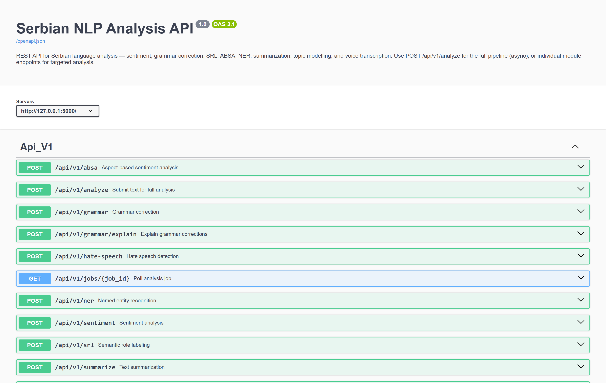
</p>

---

## Running on a Remote GPU Machine

Set `"mode": "remote"` in `config.json` and point `remote.base_url` at a vLLM server running your model. The Classla, sentiment, hate-speech, and Whisper models still run locally (or on whichever machine runs `app.py`).

Alternatively, run the entire application on the remote machine:

```bash
python app.py
```

Then open `http://<remote-machine-ip>:5000` in your browser. With a GPU available, all models switch to GPU automatically.

> **Note:** To make the app reachable from other machines, add `host="0.0.0.0"` to the `app.run()` call in `app.py`. For production use, run behind gunicorn instead.

---

## Project Structure

```
├── app.py                        # Flask/APIFlask application entry point
├── config.json                   # Runtime config (not committed — see config.example.json)
├── src/
│   ├── api/                      # REST API blueprint and schemas
│   │   ├── v1.py
│   │   └── schema.py
│   ├── ui/                       # Frontend (HTML) routes and logic
│   │   └── routes.py
│   ├── services/                 # Business logic and NLP engines
│   │   ├── analysis_pipeline.py  # Orchestrates the full pipeline
│   │   ├── grammar_corrector.py
│   │   ├── sentiment_analyzer.py
│   │   ├── word_controller.py
│   │   └── ... (other analyzers)
│   ├── core/                     # Core logic, constants, and shared config
│   │   ├── pipeline.py
│   │   ├── model_config.py
│   │   ├── constants.py
│   │   └── transliteration.py
│   └── infrastructure/           # Background jobs and data access
│       ├── task_service.py       # Thread-pool task execution and progress tracking
│       ├── job_store.py
│       └── repositories.py       # Serbian WordNet / stopword dictionary access
├── data/
│   ├── Serbian-Wordnet.csv       # Local word definitions
│   └── SSWdictionary.csv         # Serbian stopwords
├── docs/
│   └── screenshots/              # README screenshots
├── static/
│   ├── css/style.css             # Theming (light/dark), diff CSS
│   └── js/app.js                 # Progressive rendering, GrammarDiff, poll loop
├── templates/
│   ├── index.html
│   ├── compare.html              # Side-by-side model comparison page
│   └── partials/
└── requirements.txt
```
